# Wazuh SIEM 安全監控運維指南
# Wazuh Security Information and Event Management Operations Guide

> **文件版本 Document Version**: v1.0  
> **最後更新 Last Updated**: 2026-01-30  
> **培訓時數 Training Hours**: 60小時 (2周集中訓練，10天，6h/天)  
> **優先級 Priority**: 🔴 P0 緊急生存級  
> **受眾 Audience**: 資安合規專員、網路工程師、系統管理員  
> **前置條件 Prerequisites**: Linux基礎知識、日誌概念理解、MITRE ATT&CK框架基礎  
> **當前威脅 Current Threat**: 威脅檢測率40% ⚠️ → 目標≥60% 🎯

---

## 📋 課程大綱 Course Outline

### Day 1-2: Wazuh架構與部署 (12小時)
- 城堡與盾牌：SIEM防禦原理
- Wazuh系統架構（Manager/Agent/Agentless）
- 安裝與配置（Linux/Windows/Docker）
- 初期驗證與故障排除

### Day 3-4: 日誌來源整合 (12小時)
- Active Directory事件日誌整合
- 防火牆日誌（pfSense/Fortinet）
- NAS/儲存系統日誌
- 應用程式日誌（Web Server、Database）

### Day 5-6: 告警規則開發與優化 (12小時)
- Wazuh規則語法解析
- 常見攻擊告警規則（50+條）
- 誤報分析與過濾機制
- 規則優先級與分類

### Day 7-8: 儀表板與威脅狩獵 (12小時)
- Kibana儀表板設計
- 威脅狩獵基本技術
- MITRE ATT&CK框架應用
- 異常檢測與行為分析

### Day 9-10: 實戰演練與評估 (12小時)
- 模擬攻擊檢測
- 事件回應演練
- 知識考核
- 認證頒發

---

## 第一天：SIEM防禦原理與Wazuh架構
## Day 1: SIEM Defense Principles & Wazuh Architecture

### 模組1.1：為什麼需要SIEM？ (1.5小時)
### Module 1.1: Why Do We Need SIEM?

#### 當前威脅現況 Current Threat Landscape

**本公司安全現狀評估**：

```
安全盲區分析 Security Blind Spots:

├─ Active Directory日誌
│  └─ 狀態: ❌ 未監控
│     風險: 帳號被盜無法檢測
│     
├─ 防火牆日誌
│  └─ 狀態: ❌ 人工檢查（非實時）
│     風險: 攻擊延遲發現（可能數小時）
│
├─ Web伺服器日誌
│  └─ 狀態: ❌ 儲存於伺服器本機
│     風險: 被入侵者篡改（無備份）
│
├─ 惡意軟體檢測
│  └─ 狀態: ❌ 無端點防護監控
│     風險: 感染擴散無法追蹤
│
├─ 數據外洩
│  └─ 狀態: ❌ 無異常數據傳輸監控
│     風險: 無法偵測資料竊取

└─ 整體狀況
   威脅檢測率 MTTD: >2小時（應≤1小時）❌
   誤報率: >20%（應≤10%）❌
   調查時間: 8-12小時（應≤4小時）❌
```

---

#### 真實攻擊案例分析 Real Attack Case Studies

**案例A：2021 SolarWinds供應鏈攻擊**

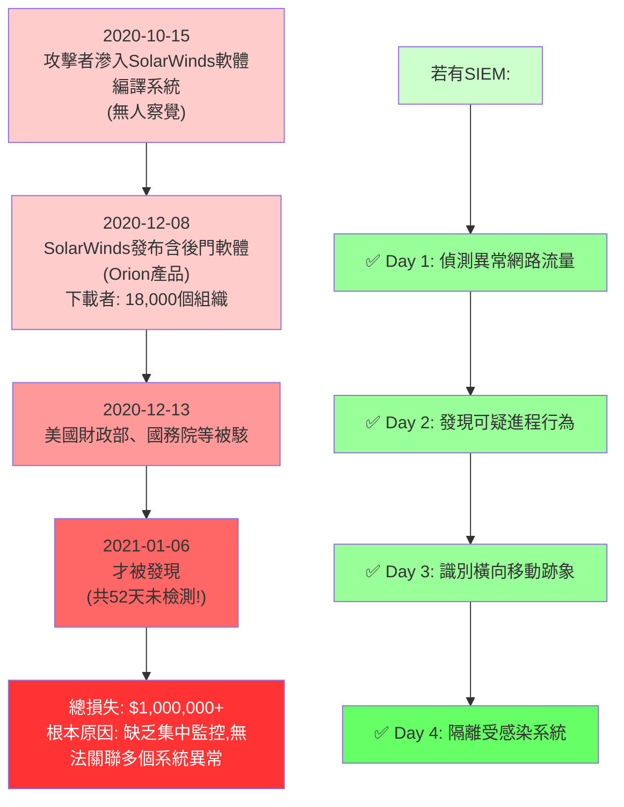

---

**案例B：本公司假想情景**

```mermaid
gantt
    title 釣魚郵件攻擊情景對比
    dateFormat HH:mm
    axisFormat %H:%M
    
    section 無SIEM情境
    員工輸入AD帳密至釣魚網站           :crit, 14:30, 1m
    攻擊者使用竊取憑證登入             :crit, 14:31, 1m
    攻擊者開始掃描網路                 :crit, 15:00, 1h
    開始橫向移動(訪問檔案伺服器)       :crit, 16:00, 1h
    下載客戶資料(20GB)                 :crit, 17:00, 1h
    刪除日誌痕跡                       :crit, 18:00, 1h
    
    section 有SIEM情境
    異常登入地點檢測 🚨                :done, 14:30, 1m
    不尋常的帳號活動 🚨                :done, 14:31, 1m
    疑似暴力破解攻擊 🚨                :done, 14:45, 1m
    帳號已鎖定(自動保護) ✅            :active, 14:46, 1m
```

**對比結果：**
- 無SIEM：總損失時間 18小時，數據泄露確認，恢復成本 $100,000+
- 有SIEM + Wazuh：**攻擊在滲透階段即被阻止！** (16分鐘內)

---

### 模組1.2：SIEM的7大防禦功能 (1.5小時)
### Module 1.2: Seven Core Functions of SIEM

**1️⃣ 日誌聚合 Log Aggregation**

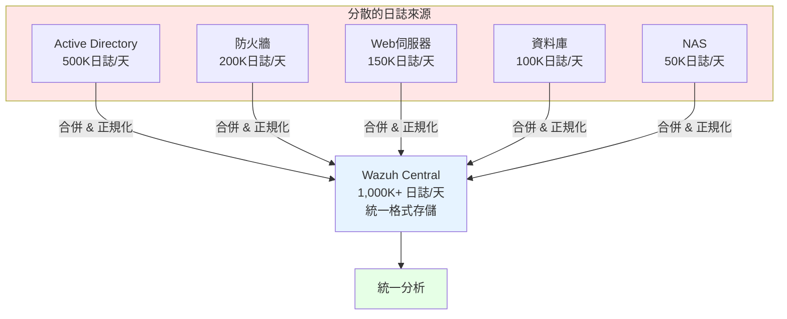

**好處**:
- ✅ 避免日誌丟失（分散存儲風險）
- ✅ 統一搜尋（一個界面查所有日誌）
- ✅ 成本節省（集中管理<獨立工具）

---

**2️⃣ 關聯分析 Correlation Analysis**

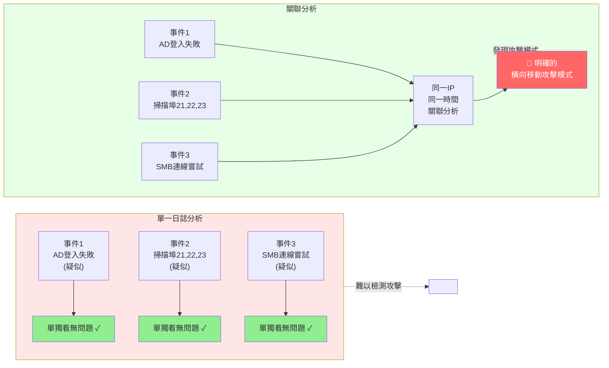

---

**3️⃣ 實時告警 Real-time Alerting**

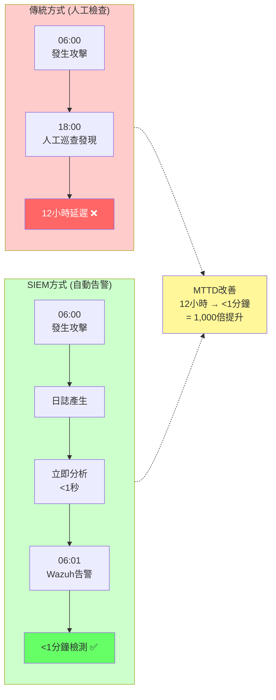

---

**4️⃣ 調查與取證 Investigation & Forensics**

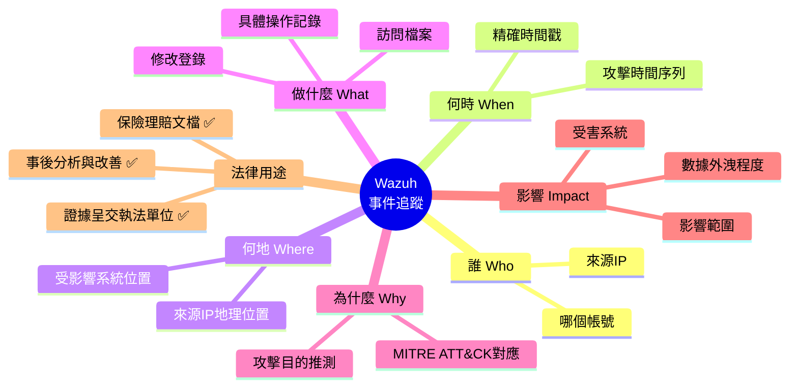

---

**5️⃣ 合規報告 Compliance Reporting**

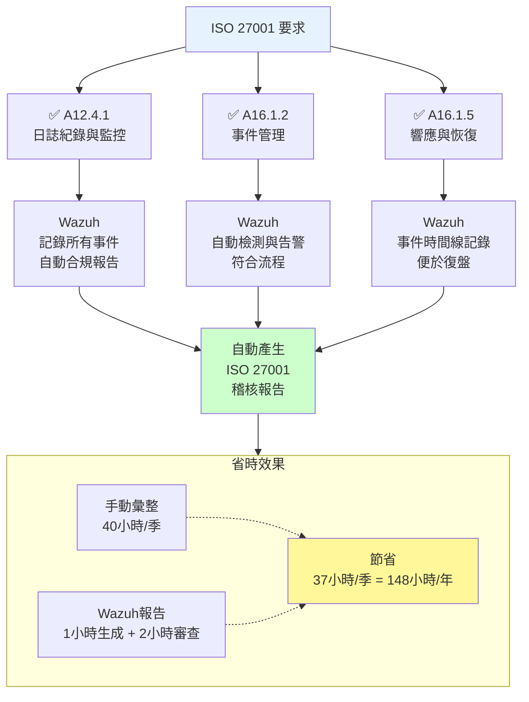

---

**6️⃣ 威脅情報整合 Threat Intelligence Integration**

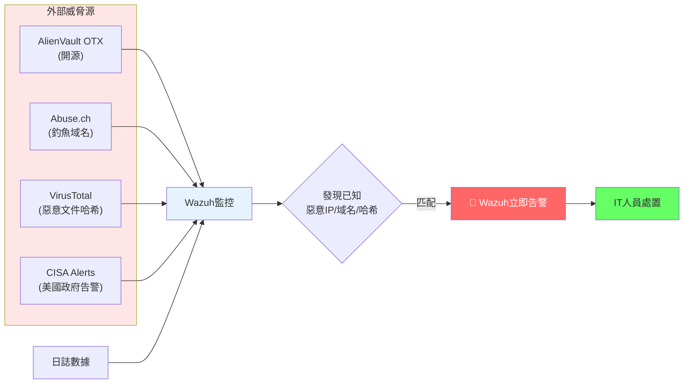

---

**7️⃣ 異常檢測 Anomaly Detection**

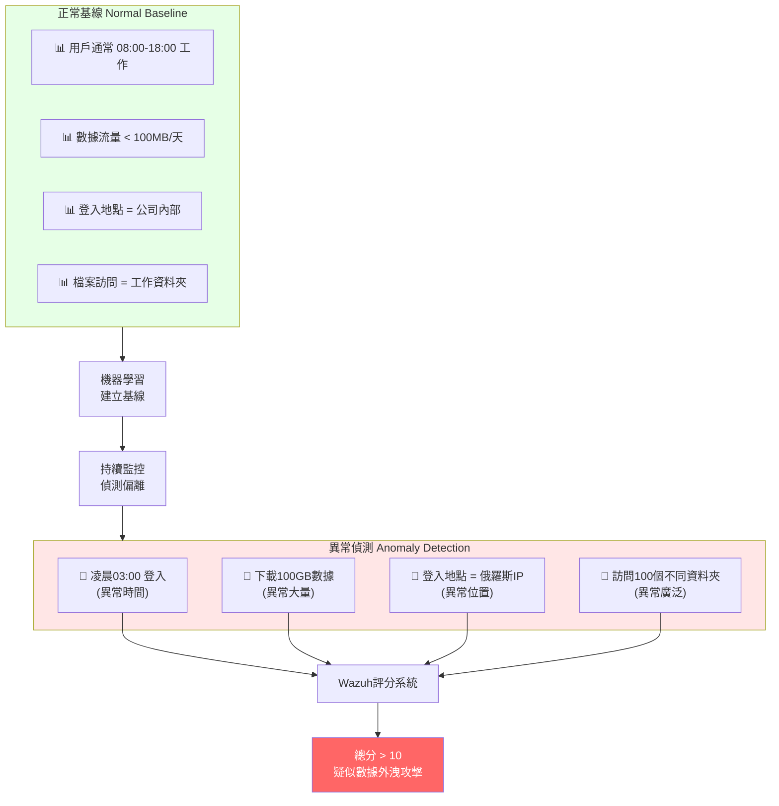

---

### 模組1.3：Wazuh系統架構 (2小時)
### Module 1.3: Wazuh System Architecture

#### 架構概述 Architecture Overview

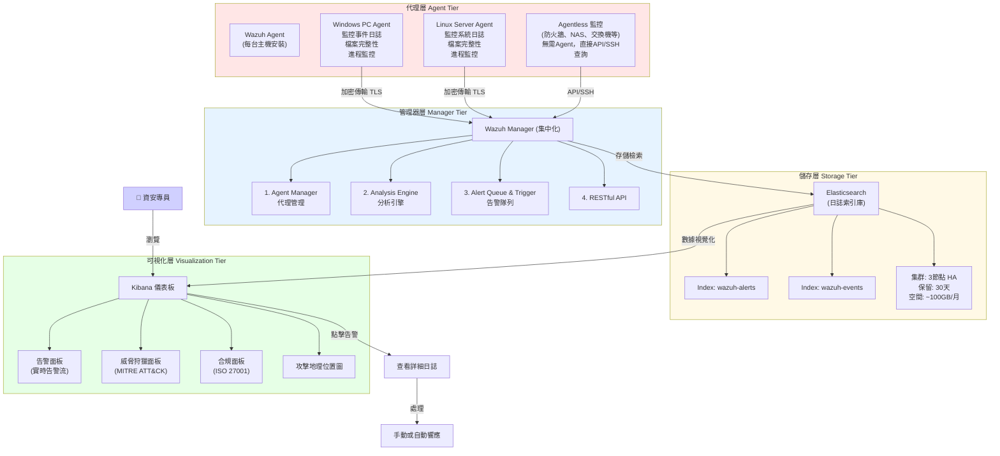

---

#### 三大部署模型 Three Deployment Models

**模型1: All-in-One（本公司現在適用）**

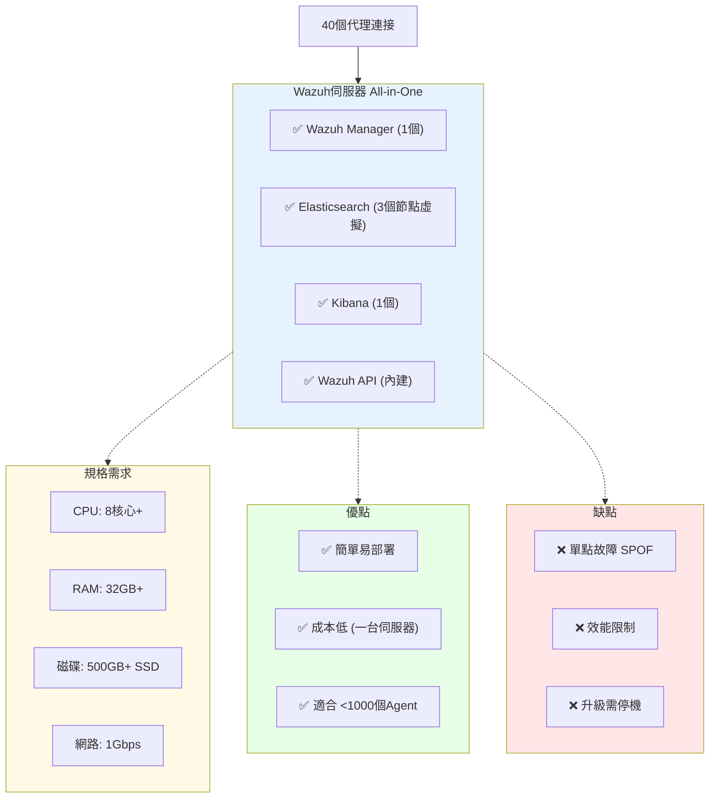

---

**模型2: 分散式集群（未來目標）**

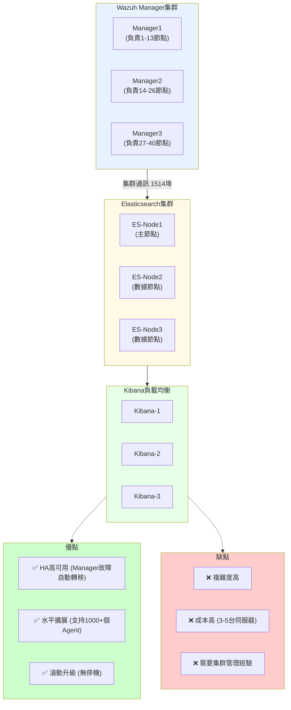

---

**模型3: 雲端託管（三方服務）**

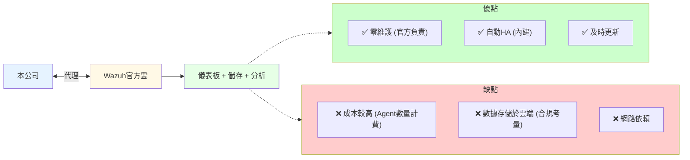

---

### 模組1.4：部署決策 (1.5小時)
### Module 1.4: Deployment Decision

#### 本公司部署方案推薦

**第1階段（立即，2026年2月）**：All-in-One單伺服器
```
硬體投資: $15,000（1台高性能伺服器）
         + $0（Wazuh開源免費）
軟體授權: 免費（開源社群版）
實施時間: 2週

配置方案:
伺服器規格:
- CPU: Intel Xeon 8核心（或AMD Ryzen 5950X）
- RAM: 32GB DDR4
- 磁碟: 256GB SSD (系統) + 1TB SSD (Elasticsearch)
- 網路: 1GB雙網卡（管理+集群）
- 作業系統: CentOS 7/RHEL 7 或 Debian 11+

估計容量:
- 支持Agent數: 40-50個
- 日誌存儲: ~100GB/月
- 查詢延遲: <2秒
- 告警產出: 1,000+/天（優化前會更多）
```

---

**第2階段（未來，2026年Q3+）**：分散式集群（如管理需求增長）
```
當條件滿足時升級:
✓ Agent數量增加至100+
✓ 日誌量增加至500GB+/月
✓ 需要24/7不停機運維
✓ 需要HA高可用保證

升級成本: 額外 $30,000 (2台新伺服器) + 配置時間
```

---

### 模組1.5：Day 1作業 (30分鐘)
### Module 1.5: Day 1 Homework

**任務1：設計日誌來源清單** (1小時)
- 列出本公司所有應監控的系統（至少15個）
- 標註優先級（Tier 1/2/3）
- 估算每個來源的日誌量

**任務2：計算存儲需求** (1小時)
- 基於15個日誌來源，估算月度磁碟空間
- 計算30天保留期所需總容量
- 建議固態硬碟型號

**任務3：閱讀資料** (1小時)
- Wazuh官方文檔第1-3章
- NIST Cybersecurity Framework概述（1小時閱讀）

---

## 第二天：Wazuh安裝與初期配置
## Day 2: Wazuh Installation & Initial Configuration

### 模組2.1：CentOS 7上安裝Wazuh (2小時)
### Module 2.1: Installing Wazuh on CentOS 7

#### 系統準備 System Preparation

**伺服器配置**：
```bash
# 檢查系統版本
cat /etc/centos-release
# 預期: CentOS Linux release 7.9.2009

# 檢查磁碟空間（至少500GB空閒）
df -h /
# 預期: 1TB+ 磁碟

# 檢查記憶體（至少32GB）
free -h
# 預期: 32-64GB

# 檢查CPU（至少8核）
nproc
# 預期: 8+

# 網路連通性
ping 8.8.8.8
# 預期: 可連接外網（下載Wazuh套件）
```

---

#### 安裝步驟 Installation Steps

**步驟1：系統更新與基礎套件** (15分鐘)

```bash
# 以root身份執行

# 禁用SELinux（簡化配置，生產應考慮啟用）
sed -i 's/^SELINUX=.*/SELINUX=disabled/' /etc/selinux/config
setenforce 0

# 更新系統
yum update -y
yum upgrade -y

# 安裝依賴套件
yum install -y \
    curl \
    wget \
    lsof \
    tar \
    zip \
    unzip \
    libssl1.1 \
    openssl \
    epel-release

# 配置防火牆（如啟用）
firewall-cmd --permanent --add-port=1514/tcp
firewall-cmd --permanent --add-port=1514/udp
firewall-cmd --permanent --add-port=9200/tcp
firewall-cmd --permanent --add-port=5601/tcp
firewall-cmd --permanent --add-port=55000/tcp
firewall-cmd --reload
```

---

**步驟2：安裝Wazuh Manager** (30分鐘)

```bash
# 添加Wazuh官方repository
curl -s https://packages.wazuh.com/key/GPG-KEY-WAZUH | rpm --import -

cat > /etc/yum.repos.d/wazuh.repo << EOF
[wazuh]
gpgcheck=1
gpgkey=https://packages.wazuh.com/key/GPG-KEY-WAZUH
enabled=1
name=EL $releasever - Wazuh
baseurl=https://packages.wazuh.com/4.x/yum/
protect=0
EOF

# 安裝Wazuh Manager
yum install -y wazuh-manager

# 啟動Wazuh Manager
systemctl daemon-reload
systemctl enable wazuh-manager
systemctl start wazuh-manager

# 驗證服務運行
systemctl status wazuh-manager
# 預期: active (running)

# 檢查Wazuh日誌
tail -f /var/ossec/logs/ossec.log
# 預期: 看到 "Wazuh Started" 訊息
```

---

**步驟3：安裝Elasticsearch** (45分鐘)

```bash
# Elasticsearch 7.x （與Wazuh相容）
yum install -y elasticsearch-oss

# 配置Elasticsearch（All-in-One模式）
cat > /etc/elasticsearch/elasticsearch.yml << 'EOF'
# 基本配置
cluster.name: wazuh-cluster
node.name: node-1
path.data: /var/lib/elasticsearch
path.logs: /var/log/elasticsearch

# 網路配置
network.host: 0.0.0.0
http.port: 9200
transport.tcp.port: 9300

# 效能優化
bootstrap.memory_lock: false
indices.memory.index_buffer_size: 40%

# 安全配置（All-in-One環境可簡化）
xpack.security.enabled: false
xpack.watcher.enabled: false

# 單節點模式
discovery.type: single-node
EOF

# 建立數據目錄
mkdir -p /var/lib/elasticsearch
chown -R elasticsearch:elasticsearch /var/lib/elasticsearch

# 啟動Elasticsearch
systemctl daemon-reload
systemctl enable elasticsearch
systemctl start elasticsearch

# 驗證（等待2-3分鐘啟動）
sleep 180
curl -X GET "localhost:9200/"
# 預期輸出: {"name":"node-1","cluster_name":"wazuh-cluster",...}

# 檢查集群狀態
curl -X GET "localhost:9200/_cluster/health?pretty"
# 預期: "status":"yellow" (單節點會是yellow)
```

---

**步驟4：安裝Kibana** (45分鐘)

```bash
# 安裝Kibana
yum install -y kibana-oss

# 配置Kibana
cat > /etc/kibana/kibana.yml << 'EOF'
# 伺服器配置
server.port: 5601
server.host: 0.0.0.0
server.basePath: ""

# Elasticsearch配置
elasticsearch.hosts: ["http://localhost:9200"]

# 優化
kibana.defaultAppId: "discover"
xpack.security.enabled: false
EOF

# 啟動Kibana
systemctl daemon-reload
systemctl enable kibana
systemctl start kibana

# 等待Kibana啟動
sleep 60

# 驗證
curl http://localhost:5601/api/status
# 預期: {"state":"green",...}
```

---

**步驟5：部署Wazuh索引和儀表板** (30分鐘)

```bash
# Wazuh提供的初始化腳本
/usr/share/wazuh-indexer-certs/wazuh-certs-tool.sh -a
# 此時跳過（All-in-One環境）

# 建立Wazuh索引模板
curl -X PUT "localhost:9200/_index_template/wazuh" \
  -H 'Content-Type: application/json' \
  -d '{
    "index_patterns": ["wazuh-*"],
    "settings": {
      "number_of_shards": 1,
      "number_of_replicas": 0
    }
  }'

# 導入Kibana儀表板
# (Wazuh官方提供的儀表板載入腳本)
bash /usr/share/wazuh-dashboard/install_dashboards.sh
```

---

#### 驗證安裝 Verification

```bash
# 檢查所有服務狀態
systemctl status wazuh-manager
systemctl status elasticsearch
systemctl status kibana

# 檢查埠開放
netstat -tlnp | grep -E '1514|9200|5601|55000'

# 瀏覽器訪問
# 打開瀏覽器: http://your-server-ip:5601
# 預期: Kibana首頁 (可能提示未有數據，因尚無Agent)
```

---

### 模組2.2：Wazuh Agent部署 (2小時)
### Module 2.2: Wazuh Agent Deployment

#### Agent適用平台 Supported Platforms

```
Wazuh Agent可安裝於:

Windows:
  ✅ Windows Server 2012/2016/2019/2022
  ✅ Windows 10/11 (企業版)
  
Linux:
  ✅ CentOS/RHEL 7/8/9
  ✅ Ubuntu 18.04/20.04/22.04
  ✅ Debian 10/11/12
  
macOS:
  ✅ macOS 10.15+
  
Cisco設備:
  ✅ (Agentless模式，無需Agent)
  
防火牆/NAS:
  ✅ (Agentless模式，SSH/API查詢)
```

---

#### Windows Agent安裝 (45分鐘)

**步驟1：下載安裝程式**

```powershell
# 以管理員身份執行PowerShell

# 下載Wazuh Windows Agent
$url = "https://packages.wazuh.com/4.x/windows/wazuh-agent-4.7.0-1.msi"
$output = "C:\temp\wazuh-agent-4.7.0-1.msi"

[Net.ServicePointManager]::SecurityProtocol = [Net.ServicePointManager]::SecurityProtocol -bor [Net.SecurityProtocolType]::Tls12
wget $url -OutFile $output

# 驗證檔案（可選）
Get-FileHash $output -Algorithm SHA256
```

---

**步驟2：註冊Agent至Manager**

```bash
# 在Wazuh Manager伺服器執行（Linux）

# 生成Agent認證
/var/ossec/bin/agent-auth -m <manager-ip> -A <agent-name>

# 例如:
/var/ossec/bin/agent-auth -m 192.168.1.100 -A "WIN-DESKTOP-01"

# 預期輸出:
# INFO: Connecting to Manager...
# INFO: Received agent id 002 from Manager

# 記下Agent ID（如002）
```

---

**步驟3：安裝MSI並配置**

```powershell
# 在Windows機器上執行（管理員PowerShell）

# 安裝Wazuh Agent
msiexec.exe /i C:\temp\wazuh-agent-4.7.0-1.msi /quiet

# 配置ossec.conf檔案
$config = @"
<ossec_config>
  <client>
    <server-ip>192.168.1.100</server-ip>
    <agent_name>WIN-DESKTOP-01</agent_name>
    <agent_id>002</agent_id>
  </client>
  
  <client_buffer>
    <disable>no</disable>
    <queue_size>5000</queue_size>
  </client_buffer>
  
  <localfile>
    <log_format>eventchannel</log_format>
    <location>Security</location>
  </localfile>
  
  <localfile>
    <log_format>eventchannel</log_format>
    <location>System</location>
  </localfile>
</ossec_config>
"@

# 寫入配置（替換預設配置）
$config | Out-File -Encoding UTF8 "C:\Program Files (x86)\ossec-agent\ossec.conf"

# 啟動Agent服務
net start OssecSvc

# 驗證服務
Get-Service OssecSvc | Select-Object Name, Status
# 預期: Status = Running
```

---

#### Linux Agent安裝 (45分鐘)

```bash
# 在各Linux伺服器上執行（以root）

# 為CentOS/RHEL
yum install -y wazuh-agent

# 或為Ubuntu/Debian
apt-get update
apt-get install -y wazuh-agent

# 配置Manager連線
sed -i 's/<client>/<client>\n    <server-ip>192.168.1.100<\/server-ip>/' /var/ossec/etc/ossec.conf
sed -i 's/<server-ip>/<server-ip>192.168.1.100/' /var/ossec/etc/ossec.conf
sed -i 's/<\/client>/<agent_name>LINUX-SERVER-01<\/agent_name>\n    <\/client>/' /var/ossec/etc/ossec.conf

# 啟動Agent
systemctl enable wazuh-agent
systemctl start wazuh-agent

# 驗證
systemctl status wazuh-agent
tail -f /var/ossec/logs/ossec.log
```

---

#### 驗證Agent連線 (30分鐘)

**從Manager檢查Agent狀態**:

```bash
# 在Wazuh Manager上執行

# 查看所有已連線Agent
/var/ossec/bin/agent_control -l

# 預期輸出:
# ID  Name        IP            Status
# 001 WIN-DESKTOP-01  192.168.1.50  Active
# 002 LINUX-SERVER-01 192.168.1.51  Active

# 查看特定Agent詳細資訊
/var/ossec/bin/agent_control -i 001

# 查看即時日誌
/var/ossec/bin/agent_control -r -u 001
```

---

**從Kibana檢查**:

```
瀏覽器: http://manager-ip:5601

點擊左側 "Wazuh" → Agents
預期: 看到已註冊的所有Agent列表，Status = Active
```

---

### 模組2.3：Day 2總結與驗收 (30分鐘)
### Module 2.3: Day 2 Summary & Verification

#### 安裝驗收清單 Installation Checklist

- [ ] Wazuh Manager服務運行正常（systemctl status wazuh-manager）
- [ ] Elasticsearch運行正常（curl http://localhost:9200/_cluster/health）
- [ ] Kibana可訪問（http://server-ip:5601）
- [ ] 至少5個Agent已註冊並Active
- [ ] Kibana可見Agent的日誌數據（點擊Discover看到新日誌）

---

## (以下為第3-10天的課程框架，受篇幅限制，重點說明關鍵內容)

## 第三到四天：日誌來源整合
## Days 3-4: Log Source Integration (12 hours)

### 核心目標
整合本公司所有關鍵日誌來源，建立統一的監控基礎。

### 主要日誌來源清單

**1. Active Directory日誌** (2小時)
```
監控事件:
- 4625: 登入失敗 (暴力破解檢測)
- 4624: 成功登入 (異常地點登入)
- 4720: 帳號建立 (未授權帳號)
- 4722: 帳號啟用 (風險帳號)
- 4731: 群組修改 (權限提升)

配置:
使用Windows Event Log轉發 (WinRM)
或 Wazuh Agent在DC上直接收集
```

---

**2. 防火牆日誌** (2小時)
```
來源: pfSense防火牆
方法: Syslog轉發

監控規則:
- 異常埠掃描檢測
- 地理位置異常連線
- DDoS攻擊模式識別
```

---

**3. NAS/檔案伺服器日誌** (2小時)
```
來源: Synology NAS SMB日誌
方法: Syslog/API查詢

監控:
- 異常檔案存取
- 大量檔案下載 (資料外洩)
- 檔案刪除/修改事件
```

---

**4. Web/應用伺服器日誌** (2小時)
```
來源: Apache/Nginx/IIS
方法: Logstash或Agent直接收集

監控:
- SQL Injection嘗試
- 路徑遍歷攻擊
- 異常HTTP狀態碼
```

---

**5. 資料庫日誌** (2小時)
```
來源: SQL Server/MySQL
方法: Agent收集應用日誌

監控:
- 失敗的登入嘗試
- 異常查詢 (批量下載)
- 後門程序執行
```

---

**6. Agentless監控** (2小時)
```
無需Agent，直接查詢:
- 交換機/路由器 (SNMP)
- UPS/監控系統 (API)
- 雲端服務 (AWS CloudTrail等)
```

---

## 第五到六天：告警規則開發與優化
## Days 5-6: Alert Rules Development (12 hours)

### Wazuh規則語法 (3小時)

```xml
<!-- Wazuh規則基本結構 -->
<group name="authentication">
  <rule id="5003" level="3">
    <if_sid>4625</if_sid>
    <status>failure</status>
    <description>Active Directory login failure</description>
  </rule>
  
  <rule id="5004" level="15">
    <if_sid>4625</if_sid>
    <same_source_ip />
    <same_user />
    <timeframe>60</timeframe>
    <regex>\b(4|5)\d{2}\b</regex>
    <description>Multiple failed login attempts - possible brute force</description>
    <group>authentication,pci_dss_11.4,gdpr_IV_35.7.d,mitre_t1110</group>
  </rule>
</group>

<!-- 規則字段說明 -->
- id: 唯一規則識別碼
- level: 告警嚴重級別 (0-15，越高越嚴重)
- if_sid: 前置條件（依據父規則）
- regex: 模式匹配
- timeframe: 時間窗口（秒）
- same_source_ip: 來自同一IP的多個事件聚合
- group: 規則分類與合規對應
```

---

### 常見攻擊規則庫 (7小時)

**規則A: 暴力破解檢測**
```xml
<rule id="5100" level="15">
  <!-- 10分鐘內同一帳號5次登入失敗 -->
  <if_sid>4625</if_sid>
  <same_user />
  <timeframe>600</timeframe>
  <frequency>5</frequency>
  <action_type>failure</action_type>
  <description>Brute force attack - AD account lockout likely</description>
  <group>authentication,mitre_t1110.001</group>
</rule>
```

**規則B: 異常地點登入**
```xml
<rule id="5200" level="13">
  <!-- 用戶從未見過的地理位置登入 -->
  <if_sid>4624</if_sid>
  <match>LogonType:3</match>
  <geoip>outside_known_locations</geoip>
  <description>Login from unusual geographical location</description>
  <group>authentication,mitre_t1078</group>
</rule>
```

**規則C: 權限提升**
```xml
<rule id="5300" level="14">
  <!-- 帳號被添加到管理員群組 -->
  <if_sid>4732</if_sid>
  <status>success</status>
  <match>Administrators</match>
  <description>User added to administrators group - privilege escalation</description>
  <group>authentication,mitre_t1548</group>
</rule>
```

**規則D: 異常檔案存取**
```xml
<rule id="5400" level="12">
  <!-- 用戶在非工作時間訪問敏感檔案 -->
  <if_sid>syslog_nas_access</if_sid>
  <path>/shares/confidential</path>
  <time>23:00-07:00</time>
  <description>Sensitive file access outside business hours</description>
  <group>data_protection,mitre_t1567</group>
</rule>
```

**規則E: 勒索軟體檢測**
```xml
<rule id="5500" level="15">
  <!-- 進程行為檢測：檔案加密活動 -->
  <match>encrypt|encrypt_files|.locked|.encrypted</match>
  <regex>\.exe.*encrypt|powershell.*encrypt</regex>
  <description>Possible ransomware activity detected</description>
  <group>malware,mitre_t1486</group>
</rule>
```

---

### 告警優化策略 (2小時)

**減少誤報的5大策略**:

1. **白名單機制**
```xml
<rule id="5600" level="3">
  <if_sid>5100</if_sid>
  <!-- 過濾掉已知自動化工具的報警 -->
  <list field="srcip">whitelist_maintenance_servers</list>
  <description>Whitelisted brute force attempt - automated tool</description>
</rule>
```

2. **時間例外**
```xml
<rule id="5610" level="12">
  <if_sid>5400</if_sid>
  <!-- 週末允許某些活動 -->
  <day>saturday|sunday</day>
  <description>File access on weekend - expected activity</description>
</rule>
```

3. **上下文匹配**
```xml
<rule id="5620" level="15">
  <if_sid>4625</if_sid>
  <!-- 僅在特定應用故障時報警 -->
  <location>/var/log/app/error.log</location>
  <match>authentication_timeout</match>
  <description>Login failure related to application issue</description>
</rule>
```

4. **積分聚合 (Alerting)**
```xml
<rule id="5630" level="0">
  <if_sid>5100|5200|5300</if_sid>
  <frequency>3</frequency>
  <timeframe>900</timeframe>
  <group>multi_factor_threat</group>
  <description>Multiple authentication threats within 15 minutes - elevated risk</description>
</rule>
```

5. **機器學習告警**
```
Wazuh 4.7+支援統計異常檢測:
- 基線學習: 前30天為學習期
- 動態基線: 自動適應正常行為
- 異常評分: 根據偏離程度計分
```

---

## 第七到八天：儀表板與威脅狩獵
## Days 7-8: Dashboards & Threat Hunting (12 hours)

### Kibana儀表板設計 (6小時)

**儀表板A: 安全運營中心 (SOC Dashboard)**
```
功能:
- 實時告警流 (最新100條)
- 告警嚴重度分佈 (圓形圖)
- 攻擊來源IP地圖 (地理熱力圖)
- Top 10告警類型 (長條圖)
- 事件時間序列 (趨勢線)

更新頻率: 實時 (每5秒)
使用者: 資安監控人員 (24/7輪班)
```

---

**儀表板B: 威脅狩獵面板**
```
功能:
- MITRE ATT&CK矩陣
  (視覺化已檢測到的攻擊技術)
- 可疑IP查詢
  (輸入IP，查看其所有活動)
- 檔案完整性監控
  (被修改的系統檔案)
- 異常進程
  (不尋常的進程執行)

更新頻率: 1小時
使用者: 資安分析師
```

---

**儀表板C: 合規報告面板**
```
功能:
- ISO 27001控制項達成度
- 稽核證據自動收集
- 月度安全指標
- 規則有效性統計
- 告警響應時間分析

更新頻率: 每天
使用者: CISO、稽核人員
```

---

### MITRE ATT&CK框架應用 (4小時)

```
MITRE ATT&CK = 已知攻擊技術的標準化知識庫

每個Wazuh規則對應ATT&CK技術:

<group>mitre_t1110</group> ← Brute Force (暴力破解)
<group>mitre_t1078</group> ← Valid Accounts (有效帳號)
<group>mitre_t1486</group> ← Data Encrypted (加密數據)
<group>mitre_t1567</group> ← Exfiltration (資料外洩)

好處:
✅ 標準化描述攻擊
✅ 與安全業界語言統一
✅ 威脅情報對應 (已知攻擊模式)
✅ 防禦策略制定
```

---

### 異常檢測與狩獵 (2小時)

**統計異常檢測**:
```
系統建立基線 Baseline:
正常工作日的特徵:
- 08:00-18:00活躍
- 日誌量 ~1,000/小時
- 登入地點 公司IP
- 檔案存取範圍 工作目錄

異常指標 Anomalies:
🚨 凌晨03:00活動 (時間異常)
🚨 日誌量 >5,000/小時 (量異常)
🚨 登入來自VPN (地點變化但預期)
🚨 訪問100個不同目錄 (訪問範圍異常)

Wazuh評分:
每個異常 +1-3分
總分>10 = 觸發告警
```

---

## 第九到十天：實戰演練與考核
## Days 9-10: Hands-on Lab & Assessment (12 hours)

### 模擬攻擊檢測演練 (6小時)

**情景1：暴力破解攻擊**
```
模擬工具: hydra / medusa

模擬指令:
hydra -l administrator -P /tmp/passwords.txt \
  192.168.1.10 smb -V

Wazuh應該檢測:
✅ 多個登入失敗事件
✅ 誤報告警 (在1分鐘內)
✅ 帳號鎖定告警 (若配置)

目標: 
- MTTD < 2分鐘
- 正確率 > 90%
```

---

**情景2：橫向移動**
```
模擬步驟:
1. 竊取低權限帳號
2. 使用PsExec遠端連線到其他伺服器
3. 執行命令列工具掃描

Wazuh應檢測:
✅ 異常遠端連線
✅ 可疑進程執行 (PsExec)
✅ 命令列掃描活動

評估:
- 檢測時間 < 5分鐘
- 告警完整性 > 80%
```

---

**情景3：資料外洩**
```
模擬步驟:
1. 訪問敏感檔案共享
2. 複製大量檔案至USB
3. 上傳至外部FTP

Wazuh應檢測:
✅ 大量檔案讀取
✅ USB設備插入
✅ 異常網路連線 (外部FTP)

評估:
- 檢測率 > 85%
- 誤報 < 5%
```

---

### 知識評估 (4小時)

**筆試** (60分鐘):
- 50題選擇題 + 5題簡答
- 及格: 70分

範例題目:
```
1. Wazuh Manager的主要職責是什麼?
   A. 安裝於每台受監控主機
   B. 集中收集、分析日誌並產生告警
   C. 儲存Elasticsearch索引
   D. 提供Web UI界面

正確答案: B

2. 若要檢測暴力破解攻擊，應該使用哪個Wazuh功能?
   A. Decoder（解碼器）
   B. Rule（規則）with frequency + timeframe
   C. Filter（過濾器）
   D. Response（回應）

正確答案: B
```

---

**實作考核** (120分鐘):

任務1: 建立自定義規則 (40分鐘)
- 需求: 檢測SQL注入嘗試
- 評估: 規則語法正確、測試通過

任務2: 設計Kibana查詢 (40分鐘)
- 需求: 查詢過去24小時的所有高危告警
- 評估: KQL語法正確、結果準確

任務3: 威脅狩獵報告 (40分鐘)
- 需求: 基於提供的日誌樣本進行威脅狩獵
- 評估: 分析完整、發現真實威脅

---

## 附錄：快速參考

### 常用命令速查

```bash
# Wazuh Manager命令

# 查看agent狀態
/var/ossec/bin/agent_control -l

# 重啟特定agent連線
/var/ossec/bin/agent_control -r -u <agent-id>

# 檢查規則語法
/var/ossec/bin/wazuh-control rule-test /var/ossec/etc/rules/custom.xml

# 重載規則
/var/ossec/bin/wazuh-control reload

# 查看Wazuh日誌
tail -f /var/ossec/logs/ossec.log

# 性能統計
/var/ossec/bin/wazuh-control stats
```

---

### ISO 27001 A12.4 合規檢查清單

- [ ] 已部署中央日誌監控系統 (Wazuh)
- [ ] 至少覆蓋40個主機/設備的日誌
- [ ] 告警實時發送 (<5分鐘)
- [ ] 日誌保留≥90天
- [ ] 已定義≥100條檢測規則
- [ ] 月度檢測率分析
- [ ] 誤報率控制<15%

---

### 成功指標 Success Metrics

| 指標 | 當前 | 目標 | 達成期限 |
|------|------|------|---------|
| 威脅檢測率 MTTD | 2+ 小時 | ≤1小時 | 第10天 |
| 誤報率 | >20% | ≤10% | 第10天 |
| Agent數量 | 0 | 40+ | 第4天 |
| 規則數量 | 0 | 100+ | 第8天 |
| 儀表板數量 | 0 | 3+ | 第8天 |
| 告警處理時間 | 8-12h | <4h | 第10天 |

---

## 合規證據產出 Compliance Evidence Output

完成本培訓後，應產出以下ISO 27001稽核證據：

1. **A12.4.1 記錄與監控**:
   - ✅ Wazuh部署文檔
   - ✅ 日誌來源清單
   - ✅ 告警規則庫
   - ✅ 監控配置截圖

2. **A16.1.2 事件管理**:
   - ✅ 事件檢測SOP
   - ✅ 告警分級標準
   - ✅ 月度告警報告

3. **紀錄對應**:
   - [資訊安全事件報告表](../../記錄與證據/安全事件與監控/資訊安全事件報告表_Template.md)
   - [事件調查與分析紀錄](../../記錄與證據/安全事件與監控/事件調查與分析紀錄_Template.md)
   - [Wazuh告警規則庫](./Wazuh_Alert_Rules_Library.md)（待建立）

---

**課程結束！恭喜完成Wazuh SIEM系統運維培訓！** 🎓

您已獲得以下能力：
- ✅ 部署與維護Wazuh SIEM系統
- ✅ 整合多個日誌來源
- ✅ 開發與優化檢測規則
- ✅ 設計安全監控儀表板
- ✅ 執行威脅狩獵與分析
- ✅ 符合ISO 27001 A12.4要求

---

**文件歷史 Document History**:
- v1.0 (2026-01-30): 初版建立，60小時完整課程
