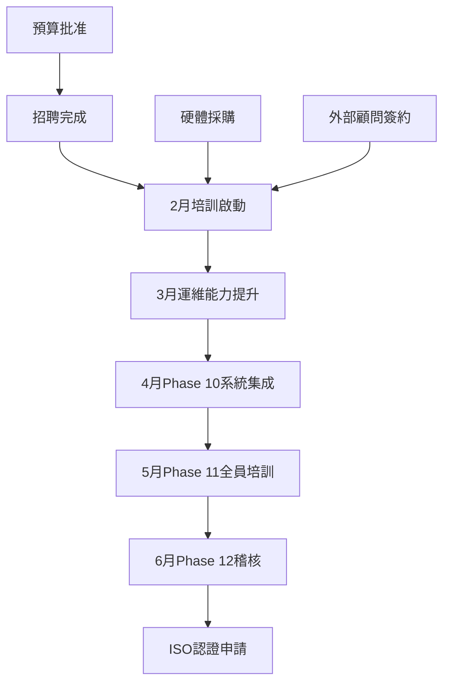

# 2026年Q1-Q2 IT技術培訓時間表
# IT Technical Training Schedule 2026 Q1-Q2

> **文件版本 Document Version**: v1.0  
> **最後更新 Last Updated**: 2026-01-30  
> **負責人 Owner**: IT經理 / IT Manager  
> **狀態 Status**: 🔴 緊急執行中 URGENT EXECUTION

---

## 執行摘要 Executive Summary

### 背景與緊迫性 Background & Urgency

**當前危機 Current Crisis**:
- 👤 人力超載205%（1人做5人工作）
- ⚠️ 核心系統故障風險90%（3個月內）
- 📅 ISO認證窗口僅剩4個月（2-6月）
- 🕐 工時缺口87%（5,160-6,600小時/年）

**培訓目標 Training Objectives**:
1. **立即填補P0技術債**（DR/BCP、SIEM、內部稽核）
2. **支援新招人員快速上手**（2-3月入職）
3. **確保Phase 9-12按時完成**（認證不延期）
4. **建立長期技術能力**（L1-L5成熟度提升）

---

## 培訓總覽 Training Overview

### 按緊迫度分類 By Priority

| 優先級 | 培訓主題數 | 總時數 | 預算 | 時間框架 |
|--------|----------|--------|------|---------|
| 🔴 **P0 緊急** | 3項 | 120h | $15-20k | 2月 (立即) |
| 🟠 **P1 關鍵** | 3項 | 80h | $8-12k | 3月 (1個月內) |
| 🟡 **P2 改善** | 4項 | 100h | $10-15k | 4-6月 (3個月內) |
| **合計 Total** | **10項** | **300h** | **$33-47k** | **Q1-Q2** |

### 按層級分類 By Level

| 層級 | 培訓主題 | 成熟度目標 | 當前 → 目標 |
|------|---------|-----------|------------|
| **L1 可靠性** | DR/BCP、備份驗證 | Level 2.5 | 1.5 → 2.5 |
| **L2 防禦** | SIEM、事件回應、弱點管理 | Level 2.5 | 1.5 → 2.5 |
| **L3 體驗** | IAM帳號管理 | Level 2.0 | 1.5 → 2.0 |
| **L4 自動化** | (Phase 3規劃) | Level 2.0 | 1.5 → 2.0 |
| **L5 文件** | ISO稽核、Git版本控制 | Level 3.0 | 2.0 → 3.0 |

---

## 2月份培訓計劃 (P0 緊急生存級)
## February Training (P0 Critical Survival)

### 🎯 階段目標 Phase Goal
**解決P0技術債，建立最小可行防禦體系**  
Resolve P0 technical debt, establish minimum viable defense

---

### 第1週 (2/3-2/7): DR/BCP業務連續性速成
### Week 1: DR/BCP Business Continuity Crash Course

#### 培訓資訊 Training Info
- **講義 Material**: [DR_BCP業務連續性培訓講義](L1_可靠性與容災/DR_BCP_Business_Continuity_Training.md)
- **形式 Format**: 🎓 完整講義 + 實操演練 (Full Course + Hands-on)
- **時數 Hours**: 40小時 (5天密集訓練)
- **受訓對象 Audience**: IT經理、系統管理員、資安實施工程師（新招）
- **地點 Location**: 會議室 + 實驗環境

#### 課程大綱 Course Outline
| 時間 | 主題 | 內容 | 交付成果 |
|------|------|------|---------|
| **Day 1** | RTO/RPO概念 | 業務影響分析、目標設定 | RTO/RPO定義文件 |
| **Day 2** | HA架構設計 | 主備/雙活/負載均衡 | HA實施計劃v1.0 |
| **Day 3** | DR計劃制定 | 異地備份、復原流程 | DR計劃草案 |
| **Day 4** | 實作演練 | Proxmox HA配置 | 測試環境HA上線 |
| **Day 5** | 桌面演練 | 模擬災難復原 | 演練報告 |

#### 緊急行動項 Urgent Actions
- [ ] **2/1前**: 採購Proxmox HA硬體（$20-30k）
- [ ] **2/1前**: 預約外部DR顧問（80小時，$10k）
- [ ] **2/2前**: 建立實驗環境（2台伺服器模擬HA）
- [ ] **2/7後**: 完成核心系統RTO/RPO定義

#### 風險與應變 Risks & Mitigation
- ⚠️ **風險**: 硬體採購延遲 → 無法實作演練
  - **應變**: 先用虛擬環境模擬，實體硬體到貨後補課
- ⚠️ **風險**: 新招人員未到職 → 受訓人數不足
  - **應變**: 錄影存檔，新人到職後補看+實作考核

---

### 第2-3週 (2/10-2/21): Wazuh SIEM運維精通
### Week 2-3: Wazuh SIEM Operations Mastery

#### 培訓資訊 Training Info
- **講義 Material**: [Wazuh SIEM運維指南](L2_防禦與監控/Wazuh_SIEM_Operations_Guide.md)
- **形式 Format**: 🎓 完整講義 + Lab環境 (Full Course + Lab)
- **時數 Hours**: 60小時 (10天，6h/天)
- **受訓對象 Audience**: 資安合規專員（新招）、網路工程師
- **地點 Location**: 實際生產環境（在職培訓）

#### 課程大綱 Course Outline
| 時間 | 主題 | 內容 | 交付成果 |
|------|------|------|---------|
| **Day 1-2** | Wazuh架構 | Manager/Agent架構、部署規劃 | 部署文件 |
| **Day 3-4** | 日誌整合 | AD/防火牆/NAS/應用日誌收集 | 10+日誌源整合 |
| **Day 5-6** | 告警規則 | 規則語法、誤報調優 | 優化50+規則 |
| **Day 7-8** | 儀表板設計 | Kibana視覺化、自定義面板 | 5個監控儀表板 |
| **Day 9** | 威脅偵測 | MITRE ATT&CK對應、異常檢測 | 威脅偵測SOP |
| **Day 10** | 實戰演練 | 模擬攻擊檢測、事件回應 | 演練報告 |

#### 緊急行動項 Urgent Actions
- [ ] **2/10前**: 確認Wazuh當前版本與配置
- [ ] **2/10前**: 準備日誌來源清單與存取權限
- [ ] **2/14前**: 建立測試告警規則流程
- [ ] **2/21後**: SIEM威脅檢測率提升至≥60%

#### 成效指標 Success Metrics
- ✅ 威脅檢測率：40% → ≥60%
- ✅ 誤報率：>20% → ≤10%
- ✅ 告警規則數：50 → 100+
- ✅ MTTD：>2h → ≤1h

---

### 第4週 (2/24-2/28): ISO 27001內部稽核員認證
### Week 4: ISO 27001 Lead Auditor Certification

#### 培訓資訊 Training Info
- **課程 Course**: ISO/IEC 27001:2022 Lead Auditor Training (外部認證機構)
- **形式 Format**: 🎓 外部認證課程 (External Certification)
- **時數 Hours**: 40小時 (5天密集訓練)
- **受訓對象 Audience**: 資安合規專員（新招）、IT經理
- **地點 Location**: 認證機構訓練中心 或 公司內訓（5人以上）
- **費用 Cost**: $3,000-5,000/人（外訓）或 $15,000（內訓含5人）

#### 課程大綱 Course Outline (標準課程)
| 時間 | 主題 | 內容 |
|------|------|------|
| **Day 1** | ISO 27001標準解讀 | Clause 4-10詳解、114項控制 |
| **Day 2** | 稽核原則與流程 | ISO 19011、稽核計劃編製 |
| **Day 3** | 現場稽核技巧 | 訪談、取證、記錄、抽樣 |
| **Day 4** | 不符合項判定 | Major/Minor NC撰寫、根因分析 |
| **Day 5** | 稽核報告撰寫 + 考試 | 報告編製、筆試+口試 |

#### 緊急行動項 Urgent Actions
- [ ] **2/1前**: 決定外訓或內訓（取決於招聘進度）
- [ ] **2/5前**: 報名並繳費
- [ ] **2/20前**: 預習ISO 27001:2022標準文件
- [ ] **2/28後**: 取得Lead Auditor證書

#### 認證後行動 Post-Certification Actions
- [ ] 建立內部稽核工作紙模板
- [ ] 規劃Phase 12稽核排程（3輪，5月完成）
- [ ] 準備稽核工具包（檢查清單、取證設備）

---

### 2月總結指標 February Summary Metrics

| 指標 | 目標 | 驗收標準 |
|------|------|---------|
| **培訓完成率** | 100% | 3項課程全部完成 |
| **核心RTO/RPO定義** | ✅ 完成 | 至少5個關鍵系統已定義 |
| **HA實施計劃** | ✅ 批准 | 管理層批准+預算到位 |
| **SIEM告警優化** | 60%檢測率 | 實測演練達標 |
| **稽核員認證** | 2人 | IT經理+資安合規專員取證 |
| **預算執行** | $15-20k | 培訓+顧問費用已支出 |

---

## 3月份培訓計劃 (P1 關鍵技能)
## March Training (P1 Critical Skills)

### 🎯 階段目標 Phase Goal
**強化運維能力，降低MTTR，支援Phase 10系統集成**  
Enhance operations, reduce MTTR, support Phase 10 integration

---

### 第1-2週 (3/3-3/14): IAM帳號生命週期管理
### Week 1-2: IAM Account Lifecycle Management

#### 培訓資訊 Training Info
- **講義 Material**: [IAM帳號管理手冊](L3_使用者體驗/IAM_Account_Management_Manual.md)
- **形式 Format**: 📖 參考文件 + 實操指南 + 術語表 (Reference + Hands-on)
- **時數 Hours**: 30小時 (10天，3h/天在職培訓)
- **受訓對象 Audience**: 系統管理員、資安合規專員、IT支援
- **地點 Location**: 實際環境操作

#### 學習模組 Learning Modules
| 模組 | 時數 | 內容 | 實作任務 |
|------|------|------|---------|
| **模組1** | 8h | Okta基本操作 | 建立10個測試帳號 |
| **模組2** | 6h | AD整合配置 | 完成AD Sync設定 |
| **模組3** | 6h | MFA部署 | 為特權帳號啟用MFA |
| **模組4** | 5h | 帳號自動化 | 撰寫供應/停用腳本 |
| **模組5** | 5h | 權限審查 | 產出月度審查報告 |

#### 交付成果 Deliverables
- [ ] Okta管理SOP（20頁）
- [ ] 帳號供應/停用自動化腳本（PowerShell）
- [ ] 權限審查報告模板
- [ ] 技術術語表（IAM專用）

---

### 第3週 (3/17-3/21): 資安事件回應流程
### Week 3: Security Incident Response Process

#### 培訓資訊 Training Info
- **講義 Material**: [事件回應流程SOP](L3_使用者體驗/Incident_Response_SOP.md)
- **形式 Format**: 📖 參考手冊 + 桌面演練 (Reference + Tabletop Exercise)
- **時數 Hours**: 30小時 (5天密集訓練)
- **受訓對象 Audience**: 全IT團隊（必修）
- **地點 Location**: 會議室 + 實際案例分析

#### 課程結構 Course Structure
| 時間 | 主題 | 活動 | 交付成果 |
|------|------|------|---------|
| **Day 1** | 事件分類 | P0-P3定義、升級機制 | 分類矩陣 |
| **Day 2** | 標準流程 | 檢測→隔離→調查→修復 | 流程圖SOP |
| **Day 3** | 常見事件應對 | 惡意軟體/釣魚/DDoS | 應對手冊 |
| **Day 4** | 桌面演練 | 模擬勒索軟體攻擊 | 演練報告 |
| **Day 5** | 記錄與復盤 | 事件日誌、教訓學習 | 報告模板 |

#### 桌面演練情境 Tabletop Scenarios
1. **情境A**: 員工電腦中勒索軟體（Ransomware）
2. **情境B**: 核心伺服器遭受DDoS攻擊
3. **情境C**: 特權帳號疑似被盜用

#### 成效指標 Success Metrics
- ✅ MTTR目標：8-12h → ≤4h
- ✅ 事件記錄完整性：50% → 90%
- ✅ 升級決策正確率：70% → 95%

---

### 第4週 (3/24-3/28): 備份驗證與復原測試
### Week 4: Backup Verification & Restore Testing

#### 培訓資訊 Training Info
- **講義 Material**: [備份驗證指南](L3_使用者體驗/Backup_Verification_Guide.md)
- **形式 Format**: 📖 操作清單 + 實作 (Checklist + Hands-on)
- **時數 Hours**: 20小時 (5天，4h/天)
- **受訓對象 Audience**: 系統管理員、備份工程師
- **地點 Location**: 實際生產環境

#### 實作任務 Practical Tasks
| 任務 | 描述 | 驗收標準 |
|------|------|---------|
| **任務1** | Veeam完整備份 | 完成1次完整備份 |
| **任務2** | 檔案級還原 | 成功還原10個測試檔案 |
| **任務3** | VM完整還原 | 還原1台測試VM至可運作 |
| **任務4** | 異地備份驗證 | 確認雲端備份可下載 |
| **任務5** | 備份報告產出 | 自動化產生月度報告 |

#### 交付成果 Deliverables
- [ ] 備份作業SOP（15頁）
- [ ] 月度測試檢查清單
- [ ] 備份監控儀表板
- [ ] 異地備份驗證腳本

---

### 3月總結指標 March Summary Metrics

| 指標 | 目標 | 驗收標準 |
|------|------|---------|
| **培訓完成率** | 100% | 3項課程全部完成 |
| **Okta帳號管理** | 上線 | 自動化供應/停用運作 |
| **事件回應MTTR** | ≤4h | 桌面演練達標 |
| **備份測試頻率** | 1次/月 | 建立月度測試機制 |
| **SOP文件產出** | 3份 | IAM、事件回應、備份 |
| **預算執行** | $8-12k | 培訓費用已支出 |

---

## 4-6月培訓計劃 (P2 改善級)
## April-June Training (P2 Improvement)

### 🎯 階段目標 Phase Goal
**體系完善，完成Phase 11-12，準備認證稽核**  
System improvement, complete Phase 11-12, prepare for certification

---

### 4月: 弱點管理與網路安全
### April: Vulnerability Management & Network Security

#### 4月第1-2週: 弱點掃描與修補流程
**時間**: 4/1-4/11 | **時數**: 25小時  
**講義**: [Nessus弱點管理待辦清單](L2_防禦與監控/Vulnerability_Management_Checklist.md)  
**形式**: 📋 待辦清單 + 操作演練

**學習目標**:
- [ ] Nessus Professional操作（掃描策略配置）
- [ ] 漏洞評估與CVSS評分
- [ ] 修補優先級排列與追蹤
- [ ] 產出月度弱點報告

**交付**: 弱點管理流程SOP、修補追蹤表

---

#### 4月第3-4週: 防火牆策略與網路分段
**時間**: 4/14-4/25 | **時數**: 25小時  
**講義**: [防火牆策略與網路分段](L5_文件與合規/Firewall_Network_Segmentation.md)  
**形式**: 📋 設計模板 + 審查清單

**學習目標**:
- [ ] VLAN規劃與分段策略
- [ ] 防火牆規則撰寫（最小權限）
- [ ] IDS/IPS配置（pfSense + Suricata）
- [ ] 防火牆規則審查與清理

**交付**: 網路分段設計圖、防火牆政策文件v1.0

---

### 5月: 文件管理與全員培訓
### May: Documentation & Organization-wide Training

#### 5月第1-2週: Git文件版本控制
**時間**: 5/5-5/16 | **時數**: 20小時  
**講義**: [Git版本控制操作指南](L5_文件與合規/Git_Version_Control_Guide.md)  
**形式**: 📋 操作清單 + 範例

**學習目標**:
- [ ] Git基礎操作（clone, commit, push, pull）
- [ ] 文件撰寫規範（Markdown格式）
- [ ] 文件更新流程（隨系統變更同步）
- [ ] 版本衝突解決

**交付**: 文件管理手冊、Git工作流程圖

---

#### 5月第3-4週: Phase 11全員資安意識培訓
**時間**: 5/19-5/30 | **時數**: 30小時  
**形式**: 🎬 短視頻教程 + 釣魚演練

**對象**: 全體員工（必修）

**培訓模組**:
1. 密碼安全與MFA使用（5分鐘視頻）
2. 釣魚郵件識別（10個案例分析）
3. 社交工程攻擊防範（情境模擬）
4. 資料分類與處理（5分鐘視頻）
5. 安全事件回報管道（流程圖）

**實戰演練**:
- [ ] 釣魚郵件模擬測試（全員）
- [ ] 點擊率目標：<10%
- [ ] 回報率目標：>20%

**交付**: 全員培訓證書、釣魚演練報告

---

### 6月: Phase 12內部稽核準備
### June: Phase 12 Internal Audit Preparation

#### 6月全月: 內部稽核3輪執行
**時間**: 6/2-6/30 | **工時**: 600小時（資安合規專員主導）

**稽核排程**:
- **第1輪** (6/2-6/13): 全面稽核114項控制
- **第2輪** (6/16-6/23): 重點稽核高風險項目
- **第3輪** (6/26-6/30): 不符合項驗證

**支援培訓** (20小時):
- [ ] 稽核受訪技巧（各部門代表）
- [ ] 證據準備工作坊（IT團隊）
- [ ] 不符合項矯正措施演練

**關鍵里程碑**:
- [ ] 6/13: 第1輪稽核報告完成
- [ ] 6/23: 第2輪稽核報告完成
- [ ] 6/30: 第3輪驗證完成，稽核結案

---

## 預算與資源規劃
## Budget & Resource Planning

### 培訓預算明細 Training Budget Breakdown

| 月份 | 培訓項目 | 內部時數 | 外部費用 | 小計 |
|------|---------|---------|---------|------|
| **2月** | DR/BCP講義 | 40h | $0 | $0 |
| **2月** | SIEM運維 | 60h | $0 | $0 |
| **2月** | ISO認證課程 | 0h | $15,000 (內訓5人) | $15,000 |
| **2月** | DR顧問諮詢 | 0h | $10,000 (80h) | $10,000 |
| **3月** | IAM/事件/備份 | 80h | $3,000 (Okta認證) | $3,000 |
| **4月** | 弱點/防火牆 | 50h | $2,000 (Nessus授權) | $2,000 |
| **5月** | Git/全員培訓 | 50h | $5,000 (視頻製作) | $5,000 |
| **6月** | 稽核執行 | 600h | $0 | $0 |
| **其他** | 線上學習平台 | - | $5,000 (年訂閱) | $5,000 |
| **合計** | - | **880h** | **$40,000** | **$40,000** |

**註**: 內部時數成本未計入（由現有人力吸收）

---

### 講師資源 Instructor Resources

| 主題 | 主講師 | 助教 | 外部支援 |
|------|--------|------|---------|
| DR/BCP | IT經理 | 系統管理員 | DR顧問（80h） |
| SIEM | 資安合規專員 | 網路工程師 | - |
| ISO稽核 | 外部認證講師 | - | 認證機構 |
| IAM | 系統管理員 | 資安合規專員 | - |
| 事件回應 | 資安合規專員 | IT經理 | - |
| 備份 | 系統管理員 | - | - |
| 弱點管理 | 資安實施工程師 | - | - |
| 防火牆 | 網路工程師 | - | - |
| Git | 資安合規專員 | - | - |
| 全員培訓 | IT經理 | 全IT團隊 | 視頻製作公司 |

---

## 風險管理 Risk Management

### 高風險項目 High-Risk Items

| 風險 | 機率 | 影響 | 應變措施 |
|------|------|------|---------|
| 新招人員延遲到職 | 高 | 嚴重 | 外包臨時支援+現有人員加班 |
| 培訓時間衝突業務 | 中 | 中 | 採用在職培訓+非尖峰時段 |
| 預算不足 | 低 | 中 | 優先P0項目+延後P2項目 |
| 外部顧問品質不佳 | 中 | 中 | 事前審查資歷+設定驗收標準 |
| Phase 10系統集成延誤 | 高 | 嚴重 | 增加外部顧問工時+延後非關鍵培訓 |

---

### 關鍵依賴 Critical Dependencies

**最關鍵路徑**: 招聘 → 2月培訓 → 6月稽核 → ISO認證  
**緩衝時間**: 0天（無任何延遲空間）

---

## 成效追蹤 Performance Tracking

### 每週檢核點 Weekly Checkpoints

**會議時間**: 每週五 16:00-17:00  
**參與者**: IT經理、培訓講師、受訓學員代表  
**議程**:
1. 本週培訓完成度（%）
2. 學員反饋與困難點
3. 下週培訓準備狀況
4. 風險預警與應變

---

### 月度儀表板 Monthly Dashboard

| 指標 | 2月目標 | 3月目標 | 4-6月目標 |
|------|---------|---------|----------|
| 培訓完成率 | 100% | 100% | 100% |
| 技能提升（⭐數） | +1.0 | +0.5 | +0.5 |
| 技術債償還 | 3項P0 | 3項P1 | 4項P2 |
| 證書/認證取得 | 2張 | 1張 | 2張 |
| SOP文件產出 | 3份 | 3份 | 4份 |
| 預算執行率 | 62.5% | 70% | 100% |

---

### 最終驗收標準 Final Acceptance Criteria

**Q2結束時（6/30）必須達成**:
- ✅ 10項培訓全部完成
- ✅ L1-L5成熟度平均≥2.5
- ✅ P0/P1技術債100%償還
- ✅ Phase 12內部稽核通過（不符合項<5個）
- ✅ 全員資安意識培訓完訓率≥95%
- ✅ ISO 27001認證申請文件已提交

---

## 附錄 Appendix

### A. 培訓講義索引 Training Materials Index

| 編號 | 檔案名稱 | 層級 | 優先級 | 狀態 |
|------|---------|------|--------|------|
| L1-01 | [DR_BCP業務連續性培訓講義](L1_可靠性與容災/DR_BCP_Business_Continuity_Training.md) | L1 | P0 | 📝 待建立 |
| L1-02 | [備份驗證指南](L3_使用者體驗/Backup_Verification_Guide.md) | L1 | P1 | 📝 待建立 |
| L2-01 | [Wazuh SIEM運維指南](L2_防禦與監控/Wazuh_SIEM_Operations_Guide.md) | L2 | P0 | 📝 待建立 |
| L2-02 | [ISO27001內部稽核指南](L2_防禦與監控/ISO27001_Internal_Audit_Guide.md) | L2/L5 | P0 | 📝 待建立 |
| L2-03 | [弱點管理待辦清單](L2_防禦與監控/Vulnerability_Management_Checklist.md) | L2 | P2 | 📝 待建立 |
| L3-01 | [IAM帳號管理手冊](L3_使用者體驗/IAM_Account_Management_Manual.md) | L3 | P1 | 📝 待建立 |
| L3-02 | [事件回應流程SOP](L3_使用者體驗/Incident_Response_SOP.md) | L2/L3 | P1 | 📝 待建立 |
| L5-01 | [防火牆策略與網路分段](L5_文件與合規/Firewall_Network_Segmentation.md) | L5 | P2 | 📝 待建立 |
| L5-02 | [Git版本控制指南](L5_文件與合規/Git_Version_Control_Guide.md) | L5 | P2 | 📝 待建立 |
| - | [技術詞彙表](Technical_Glossary.md) | 全層級 | 支援 | ✅ 已完成 |

---

### B. 聯絡資訊 Contact Information

**培訓協調人 Training Coordinator**:  
- IT經理 / IT Manager
- Email: it-manager@company.com
- 分機: ext. 1001

**外部顧問 External Consultants**:
- DR/BCP顧問: TBD（2/1前確認）
- ISO認證機構: TBD（2/5前確認）

**緊急聯絡 Emergency Contact**:
- CISO / 資訊安全長
- 手機: [填寫]
- Email: ciso@company.com

---

### C. 參考資源 Reference Resources

**線上學習平台**:
- Udemy Business: https://business.udemy.com/
- Pluralsight: https://www.pluralsight.com/
- Linux Academy: https://linuxacademy.com/

**技術文檔**:
- Wazuh官方文檔: https://documentation.wazuh.com/
- ISO 27001:2022標準: [內部文件庫]
- Proxmox VE文檔: https://pve.proxmox.com/wiki/

**社群資源**:
- r/sysadmin: https://www.reddit.com/r/sysadmin/
- ISO 27001論壇: https://www.iso27001security.com/
- Wazuh社群: https://wazuh.com/community/

---

**文件歷史 Document History**:
- v1.0 (2026-01-30): 初版建立，Q1-Q2完整規劃
